# InvisiThreat — Plan de Sprints Agile & Diagrammes UML de Séquence

> **Langue** : Français (descriptions et objectifs) | Anglais (noms de classes, méthodes, paramètres)
> **Convention UML** : Pattern Boundary / Control / Entity (BCE)
> **Outil de diagrammes** : PlantUML

---

## Sprint 0 — Mise en place de l'environnement et architecture

### Objectif du Sprint
Initialiser l'infrastructure technique (Docker, CI/CD, base de données), prendre les décisions d'architecture, et produire les maquettes UI initiales.

### User Stories

| ID | User Story | Critères d'acceptation | Points |
|----|-----------|------------------------|--------|
| US-00-1 | En tant que **Tech Lead**, je veux que l'environnement Docker soit opérationnel afin que toute l'équipe puisse démarrer le projet localement. | - `docker-compose up` lance backend + frontend + DB sans erreur - Variables d'env documentées dans `.env.example` - Health check `/api/health` renvoie 200 | 5 |
| US-00-2 | En tant que **Tech Lead**, je veux définir l'architecture logicielle afin de guider les décisions techniques des prochains sprints. | - Document d'architecture validé - Stack technique fixée (FastAPI, React, PostgreSQL) - Diagramme de classes global produit | 3 |
| US-00-3 | En tant que **Designer**, je veux produire les maquettes UI principales afin que l'équipe frontend ait un référentiel visuel. | - Maquettes Login, Dashboard, Scan, Vulnerabilities produites - Validées par le PO | 3 |
| US-00-4 | En tant que **DevOps**, je veux configurer le pipeline CI/CD afin d'automatiser les tests et le build. | - GitHub Actions exécute les tests à chaque push - Build Docker validé | 5 |

**Total Sprint 0 : 16 points**

### Tâches techniques

**Backend**
- [ ] Initialiser le projet FastAPI avec structure modulaire (`api/`, `core/`, `models/`, `services/`)
- [ ] Configurer SQLAlchemy + Alembic + PostgreSQL
- [ ] Créer endpoint `/api/health`
- [ ] Configurer variables d'environnement (`ENCRYPTION_KEY`, `DATABASE_URL`, `JWT_SECRET`)

**Frontend**
- [ ] Initialiser projet React + Vite + Tailwind CSS
- [ ] Configurer routing (React Router)
- [ ] Créer composants de base (Button, InputField, AppLayout)

**Base de données**
- [ ] Créer migration initiale Alembic
- [ ] Définir modèles `User`, `Role`, `Project`, `Scan`, `Vulnerability`

**DevOps**
- [ ] Écrire `docker-compose.yml` (backend, frontend, db)
- [ ] Configurer GitHub Actions (lint + tests)
- [ ] Documenter setup dans `README.md`

**Tests**
- [ ] Configurer Pytest avec fixtures de base (`conftest.py`)
- [ ] Test sanity check `/api/health`

---

### Diagramme de séquence : UC-00-1 — Health Check & Démarrage application

**Acteur(s)** : DevOps Engineer

**Participants**

| Participant | Stéréotype | Rôle |
|------------|------------|------|
| `HealthCheckForm` | «boundary» | Interface de test (navigateur / curl) |
| `HealthController` | «control» | Contrôleur de santé système |
| `DatabaseEntity` | «entity» | Entité base de données |

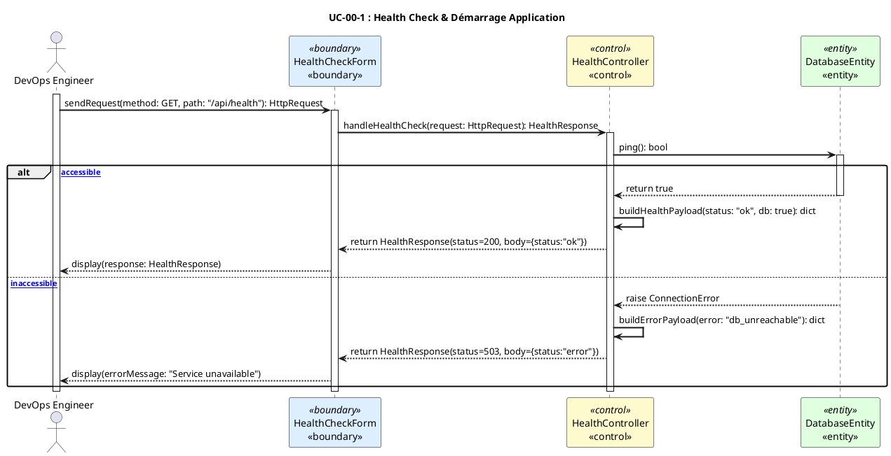

**Explication du flux** :
Le DevOps envoie une requête GET via l'interface boundary `HealthCheckForm`. Le `HealthController` orchestre la vérification en interrogeant `DatabaseEntity`. En cas de succès, il retourne un payload `{status: "ok"}` avec HTTP 200. En cas d'échec de connexion DB, il retourne HTTP 503 avec un message d'erreur.

---

## Sprint 1 — Authentification & Contrôle d'accès par rôles (RBAC)

### Objectif du Sprint
Implémenter l'authentification sécurisée (inscription, connexion, JWT, vérification email) et le système RBAC avec 4 rôles (Admin, Developer, Security Manager, Viewer).

### User Stories

| ID | User Story | Critères d'acceptation | Points |
|----|-----------|------------------------|--------|
| US-01-1 | En tant qu'**Utilisateur**, je veux m'inscrire avec mon email et un mot de passe afin d'accéder à la plateforme. | - Formulaire avec validation (email unique, password ≥ 8 chars) - Email de vérification envoyé - Compte en statut "pending" jusqu'à vérification | 5 |
| US-01-2 | En tant qu'**Utilisateur**, je veux me connecter avec mes identifiants afin d'obtenir un token JWT valide. | - Login retourne `access_token` + `refresh_token` - Token expire en 30min - Refresh token en HttpOnly cookie - Tentatives limitées (rate limiting) | 5 |
| US-01-3 | En tant qu'**Admin**, je veux assigner des rôles aux utilisateurs afin de contrôler leurs permissions. | - Admin peut modifier le rôle de tout utilisateur - Action journalisée dans l'audit log - Notification envoyée à l'utilisateur | 3 |
| US-01-4 | En tant qu'**Utilisateur**, je veux demander un changement de rôle afin d'obtenir des droits supplémentaires. | - Formulaire de demande de rôle disponible - Admin reçoit notification de demande - Utilisateur notifié de l'approbation/rejet | 3 |
| US-01-5 | En tant qu'**Utilisateur**, je veux réinitialiser mon mot de passe oublié afin de récupérer l'accès à mon compte. | - Envoi code par email - Code expire après 15min - Nouveau mot de passe enregistré avec bcrypt | 3 |
| US-01-6 | En tant qu'**Utilisateur**, je veux activer la double authentification (TOTP) afin de sécuriser mon compte. | - QR code généré pour configurateur TOTP - Vérification TOTP à la connexion si activé - Possibilité de désactiver le 2FA | 5 |

**Total Sprint 1 : 24 points**

### Tâches techniques

**Backend**
- [ ] Implémenter `POST /auth/register` — inscription avec hachage bcrypt
- [ ] Implémenter `POST /auth/login` — JWT + refresh token en cookie HttpOnly
- [ ] Implémenter `POST /auth/refresh` — rotation des refresh tokens
- [ ] Implémenter `POST /auth/logout` — révocation de session
- [ ] Implémenter `POST /auth/verify-email` — vérification par token
- [ ] Implémenter `POST /auth/forgot-password` + `POST /auth/reset-password`
- [ ] Implémenter `POST /auth/request-role` + endpoint Admin d'approbation
- [ ] Implémenter TOTP (`/auth/totp/setup`, `/auth/totp/verify`, `/auth/totp/disable`)
- [ ] Middleware RBAC `require_permission(P.xxx)`
- [ ] Service `audit_log` pour journaliser toutes les actions sensibles

**Frontend**
- [ ] Page `LoginPage.jsx` — formulaire de connexion
- [ ] Page `SignupPage.jsx` — formulaire d'inscription
- [ ] Page `ForgotPasswordPage.jsx` — réinitialisation
- [ ] Page `VerifyEmailPage.jsx` — vérification email
- [ ] `AuthContext` — gestion globale de l'état d'authentification
- [ ] Guards de route (`PrivateRoute`, vérification rôle)

**Base de données**
- [ ] Modèles `User`, `Role`, `AuthToken` (sessions), `AuditLog`
- [ ] Migration Alembic pour ces tables

**Tests**
- [ ] Tests unitaires service auth (register, login, JWT)
- [ ] Tests d'intégration endpoints auth
- [ ] Test RBAC — accès refusé si rôle insuffisant

---

### Diagramme de séquence : UC-01-1 — Inscription Utilisateur

**Acteur(s)** : Utilisateur non authentifié

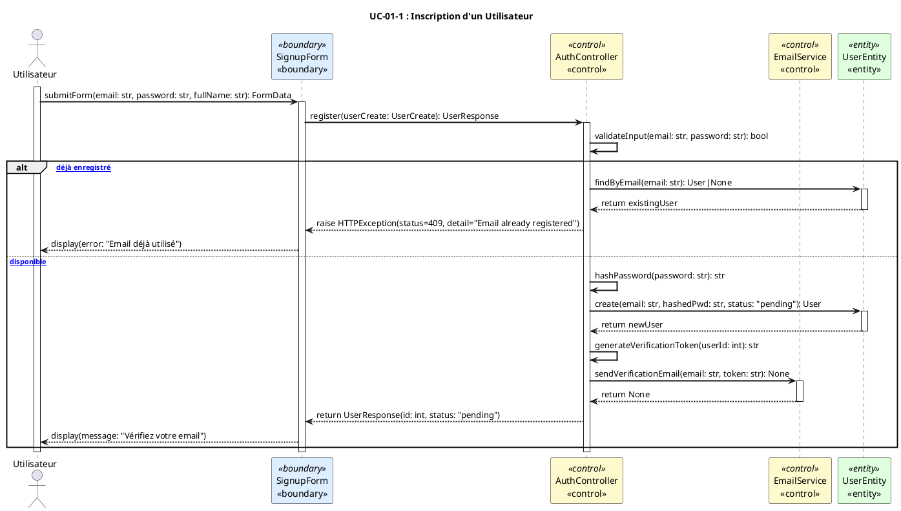

**Explication** : L'utilisateur soumet le formulaire via `SignupForm` (boundary). `AuthController` (control) valide l'unicité de l'email via `UserEntity`, hache le mot de passe avec bcrypt, persiste l'utilisateur en statut `pending`, génère un token de vérification et délègue l'envoi d'email à `EmailService`. Si l'email existe déjà, une erreur 409 est retournée.

---

### Diagramme de séquence : UC-01-2 — Connexion & Émission JWT

**Acteur(s)** : Utilisateur enregistré

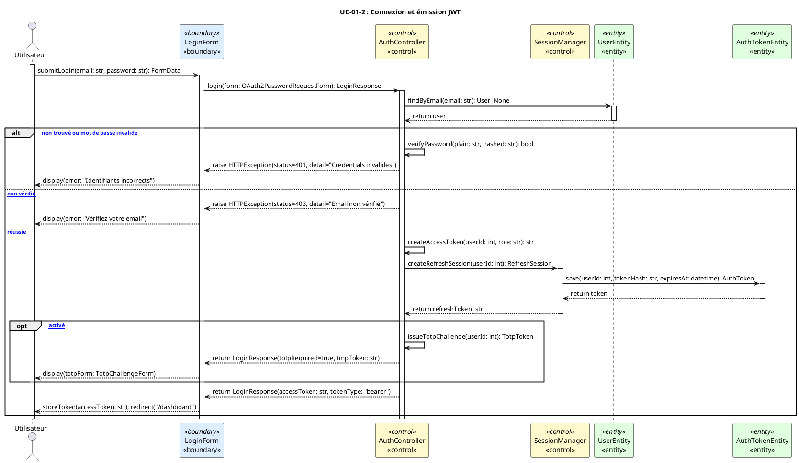

**Explication** : Le `LoginForm` transmet les identifiants à `AuthController`. Après vérification du hash bcrypt via `UserEntity`, si l'authentification réussit, `SessionManager` crée une session refresh persistée dans `AuthTokenEntity`. En cas de TOTP activé, un challenge intermédiaire est émis. Les erreurs 401/403 sont retournées sans divulguer d'information sensible.

---

### Diagramme de séquence : UC-01-3 — Attribution de rôle par l'Admin

**Acteur(s)** : Admin

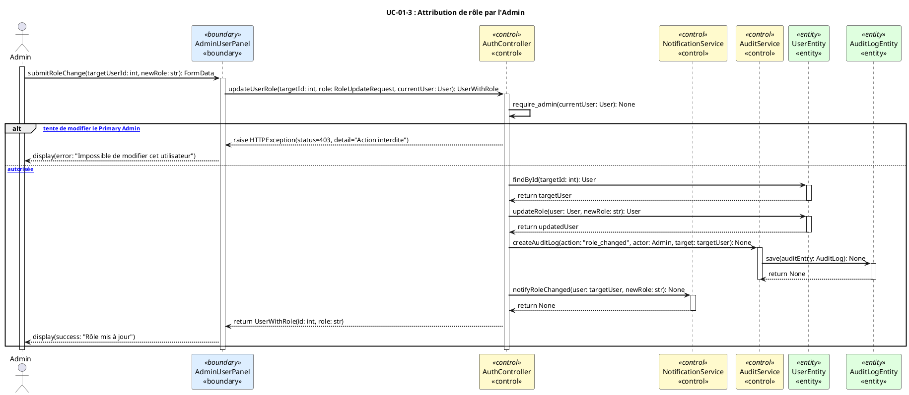

**Explication** : L'Admin soumet la modification via `AdminUserPanel` (boundary). `AuthController` vérifie d'abord que l'utilisateur courant est Admin et qu'il ne modifie pas le Primary Admin. La mise à jour est persistée dans `UserEntity`, puis journalisée via `AuditService` → `AuditLogEntity`, et une notification est envoyée à l'utilisateur concerné.

---

## Sprint 2 — Gestion des projets & Intégration GitHub

### Objectif du Sprint
Permettre aux développeurs de créer et gérer des projets, de connecter des dépôts GitHub via OAuth ou clé d'accès, et de gérer les membres d'un projet.

### User Stories

| ID | User Story | Critères d'acceptation | Points |
|----|-----------|------------------------|--------|
| US-02-1 | En tant que **Developer**, je veux créer un projet afin d'organiser mes scans de sécurité. | - Formulaire avec nom, description, type (SAST/DAST) - Projet associé à l'utilisateur créateur - Visible dans la liste des projets | 3 |
| US-02-2 | En tant que **Developer**, je veux connecter un dépôt GitHub à mon projet afin de lancer des scans sur mon code. | - Connexion via OAuth GitHub ou Personal Access Token (chiffré) - Dépôt validé (accès vérifié) - Branche par défaut configurable | 5 |
| US-02-3 | En tant qu'**Admin / Developer (owner)**, je veux gérer les membres d'un projet afin de contrôler qui peut lancer des scans. | - Ajout/retrait de membres - Attribution d'un rôle dans le projet (owner, member) - Journalisation des changements | 3 |
| US-02-4 | En tant que **Developer**, je veux consulter la liste de mes projets afin d'accéder rapidement à leurs statuts. | - Liste paginée avec statut, dernier scan, score de risque - Filtres par statut et type | 2 |
| US-02-5 | En tant qu'**Admin**, je veux superviser tous les projets de la plateforme afin d'assurer la gouvernance. | - Vue admin avec tous les projets - Possibilité d'archiver/supprimer un projet - Statistiques globales | 3 |

**Total Sprint 2 : 16 points**

### Tâches techniques

**Backend**
- [ ] `POST /projects` — création de projet
- [ ] `GET /projects` — liste des projets de l'utilisateur
- [ ] `PUT /projects/{id}` — mise à jour
- [ ] `DELETE /projects/{id}` — suppression (Admin)
- [ ] `POST /projects/{id}/github` — connexion dépôt GitHub (token chiffré)
- [ ] `GET /projects/{id}/members` + `POST /projects/{id}/members` + `DELETE`
- [ ] `GET /admin/projects` — vue admin globale
- [ ] Service `encrypt_token` pour chiffrement AES-256 des PAT GitHub

**Frontend**
- [ ] Page `ProjectsPage.jsx` — liste des projets
- [ ] Page `EditProjectPage.jsx` — création/édition
- [ ] Page `ProjectMembersPage.jsx` — gestion des membres
- [ ] Composant `ProjectDetail.jsx` — vue détaillée d'un projet
- [ ] Intégration OAuth GitHub (callback page)

**Base de données**
- [ ] Modèles `Project`, `ProjectMember`, `GitHubRepository`
- [ ] Migration Alembic

**Tests**
- [ ] Tests CRUD projets
- [ ] Test isolation : un Developer ne voit que ses propres projets
- [ ] Test chiffrement token GitHub

---

### Diagramme de séquence : UC-02-1 — Création d'un Projet

**Acteur(s)** : Developer

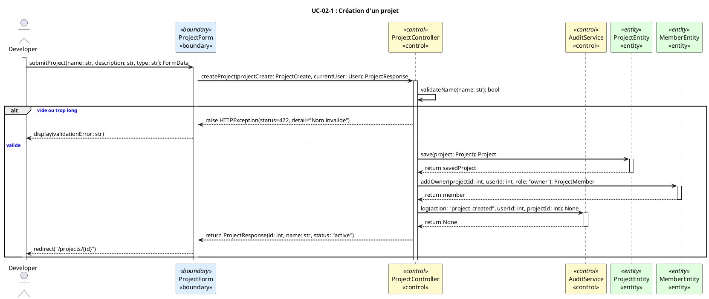

**Explication** : Le `Developer` soumet le formulaire de création via `ProjectForm` (boundary). `ProjectController` valide le nom, persiste le projet dans `ProjectEntity`, ajoute automatiquement le créateur comme owner dans `MemberEntity`, et journalise l'action. En cas de validation échouée, une erreur 422 est retournée.

---

### Diagramme de séquence : UC-02-2 — Connexion d'un Dépôt GitHub

**Acteur(s)** : Developer

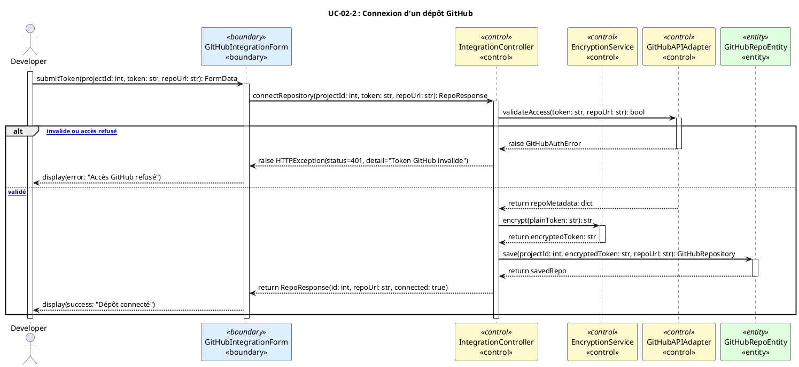

**Explication** : Le `Developer` soumet son Personal Access Token GitHub via `GitHubIntegrationForm`. `IntegrationController` valide l'accès auprès de l'API GitHub (`GitHubAPIAdapter`). Si l'accès est confirmé, `EncryptionService` chiffre le token (AES-256/Fernet) avant de le persister dans `GitHubRepoEntity`. Le token en clair n'est jamais stocké.

---

## Sprint 3 — Scan SAST (Static Application Security Testing)

### Objectif du Sprint
Implémenter le lancement, le suivi en temps réel et l'affichage des résultats de scans SAST via l'interface web et le CLI, avec normalisation des vulnérabilités détectées.

### User Stories

| ID | User Story | Critères d'acceptation | Points |
|----|-----------|------------------------|--------|
| US-03-1 | En tant que **Developer**, je veux lancer un scan SAST sur mon dépôt GitHub afin de détecter les vulnérabilités dans mon code. | - Bouton "New Scan" déclenche le scan - Scan exécuté en tâche asynchrone (Celery) - Statuts : pending → running → completed/failed | 8 |
| US-03-2 | En tant que **Developer**, je veux suivre la progression d'un scan en temps réel afin de savoir quand les résultats sont disponibles. | - WebSocket / Socket.IO envoie les mises à jour de statut - Barre de progression visible dans l'UI - Notification à la fin du scan | 5 |
| US-03-3 | En tant que **Developer**, je veux consulter les vulnérabilités détectées afin de les corriger. | - Liste des vulnérabilités avec : titre, sévérité, fichier, ligne - Filtres par sévérité (critical, high, medium, low) - Lien vers le fichier dans GitHub | 5 |
| US-03-4 | En tant que **Developer**, je veux lancer un scan via le CLI afin d'intégrer InvisiThreat dans mon workflow local. | - `invisithreat scan --project <id> --type sast` fonctionne - Résultats uploadés via API - Token CLI généré dans les settings | 5 |

**Total Sprint 3 : 23 points**

### Tâches techniques

**Backend**
- [ ] `POST /projects/{id}/scans` — déclenchement scan SAST
- [ ] Worker Celery `run_github_scan_job` — clone repo, exécute outils SAST
- [ ] Service `github_scanner` — normalisation résultats (Bandit, Semgrep)
- [ ] `GET /projects/{id}/scans` — historique des scans
- [ ] `GET /projects/{id}/scans/{scanId}` — détail d'un scan
- [ ] Socket.IO events : `scan_status_update`, `scan_completed`
- [ ] `POST /projects/{id}/cli-token` — génération token CLI
- [ ] `POST /cli/scan/upload` — upload résultats CLI

**Frontend**
- [ ] Page `NewScanPage.jsx` — wizard de lancement
- [ ] Composant de suivi temps réel (Socket.IO hook)
- [ ] Vue vulnérabilités dans `ProjectDetail.jsx`
- [ ] Filtres et tri des vulnérabilités

**Base de données**
- [ ] Modèles `Scan`, `Vulnerability`, `ScanSummary`, `ToolExecution`
- [ ] Migration Alembic

**Tests**
- [ ] Test lancement et fin de scan (mock GitHub)
- [ ] Test normalisation des résultats
- [ ] Test upload CLI

---

### Diagramme de séquence : UC-03-1 — Lancement d'un Scan SAST

**Acteur(s)** : Developer

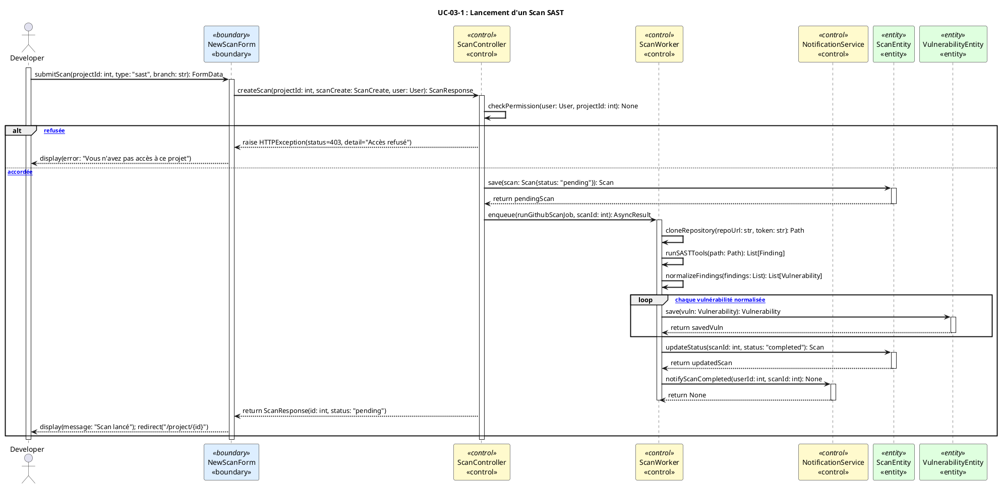

**Explication** : Le `Developer` déclenche un scan SAST via `NewScanForm`. `ScanController` vérifie les permissions, crée un `Scan` en statut `pending` dans `ScanEntity`, puis enfile la tâche dans `ScanWorker` (Celery). Le worker clone le dépôt, exécute les outils SAST, normalise les résultats, persiste chaque `Vulnerability` et met à jour le statut du scan à `completed`. Une notification est envoyée en fin de traitement.

---

### Diagramme de séquence : UC-03-2 — Suivi Temps Réel via Socket.IO

**Acteur(s)** : Developer

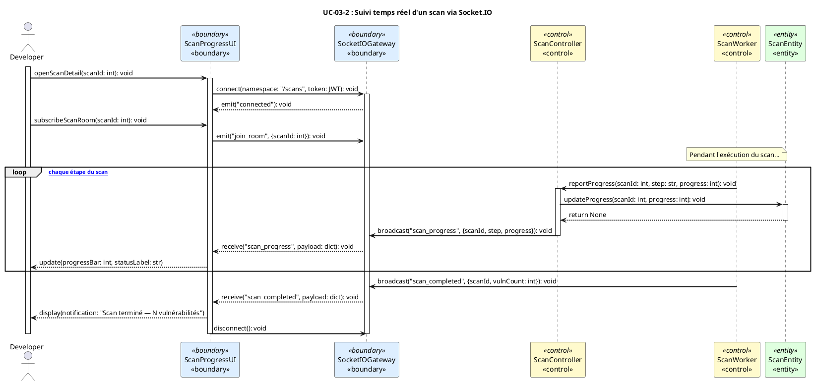

**Explication** : `ScanProgressUI` (boundary) établit une connexion Socket.IO via `SocketIOGateway` (boundary réseau). À chaque étape du scan, `ScanWorker` notifie `ScanController`, qui met à jour `ScanEntity` et diffuse un événement via le gateway. L'UI reçoit les mises à jour en temps réel et affiche la progression. À la fin, un événement `scan_completed` déclenche une notification visuelle.

---

## Sprint 4 — Scan DAST (Dynamic Application Security Testing)

### Objectif du Sprint
Implémenter le scan DAST via une sonde HTTP interne et/ou OWASP ZAP, permettre le lancement sur une URL cible, le suivi, et la consultation des résultats.

### User Stories

| ID | User Story | Critères d'acceptation | Points |
|----|-----------|------------------------|--------|
| US-04-1 | En tant que **Developer**, je veux lancer un scan DAST sur une URL cible afin de détecter les vulnérabilités applicatives à l'exécution. | - URL validée (format, accessibilité) - Scan asynchrone (Celery) - Résultats normalisés avec sévérité | 8 |
| US-04-2 | En tant que **Security Manager**, je veux comparer deux scans DAST afin de suivre l'évolution des vulnérabilités. | - Vue comparaison : vulnérabilités nouvelles, résolues, persistantes - Score de risque différentiel affiché | 5 |
| US-04-3 | En tant que **Developer**, je veux voir les alertes DAST avec leurs recommandations afin de prioriser les corrections. | - Chaque alerte inclut : CWEID, description, URL affectée, sévérité - Recommandation LLM disponible | 3 |

**Total Sprint 4 : 16 points**

### Tâches techniques

**Backend**
- [ ] `POST /projects/{id}/scans` avec `type: "dast"` et `target_url`
- [ ] Worker DAST : sonde HTTP minimaliste (probe + ZAP si disponible)
- [ ] Normalisation des alertes ZAP vers modèle `Vulnerability`
- [ ] `GET /projects/{id}/scans/compare?scan1=X&scan2=Y` — comparaison
- [ ] Service `risk_score` — calcul du score de risque post-scan

**Frontend**
- [ ] Wizard `NewScanPage.jsx` — step URL target pour DAST
- [ ] Composant comparaison de scans
- [ ] Affichage score de risque

**Base de données**
- [ ] Modèles `ScanComparison`, `RiskScore`
- [ ] Migration Alembic

**Tests**
- [ ] Test launch DAST avec URL valide/invalide
- [ ] Test normalisation alertes ZAP
- [ ] Test calcul score de risque

---

### Diagramme de séquence : UC-04-1 — Lancement d'un Scan DAST

**Acteur(s)** : Developer

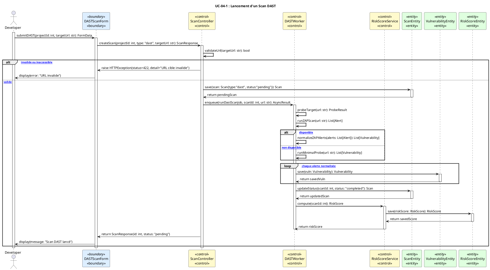

**Explication** : Après validation de l'URL cible, `ScanController` crée le scan et délègue au `DASTWorker`. Si OWASP ZAP est disponible, il l'utilise pour le scan complet, sinon il exécute une sonde HTTP minimale. Les alertes normalisées sont persistées dans `VulnerabilityEntity`. Après le scan, `RiskScoreService` calcule et persiste le score de risque.

---

## Sprint 5 — Workflow de gestion des vulnérabilités

### Objectif du Sprint
Implémenter le workflow collaboratif de traitement des vulnérabilités : assignation, changement de statut, commentaires, et notifications aux parties prenantes.

### User Stories

| ID | User Story | Critères d'acceptation | Points |
|----|-----------|------------------------|--------|
| US-05-1 | En tant que **Security Manager**, je veux assigner une vulnérabilité à un développeur afin qu'il la corrige. | - Vulnérabilité assignée à un membre du projet - Développeur notifié - Statut passe à `in_progress` | 3 |
| US-05-2 | En tant que **Developer**, je veux mettre à jour le statut d'une vulnérabilité afin de refléter mon avancement. | - Statuts : `open`, `in_progress`, `resolved`, `false_positive` - Changement journalisé - Security Manager notifié à la résolution | 3 |
| US-05-3 | En tant que **Developer / Security Manager**, je veux commenter une vulnérabilité afin de collaborer sur sa résolution. | - Commentaires avec horodatage et auteur - Liste des commentaires visible dans la vue détail | 2 |
| US-05-4 | En tant que **Developer**, je veux marquer une vulnérabilité comme faux positif afin d'éviter le bruit dans les rapports. | - Statut `false_positive` disponible - Justification requise - Security Manager notifié pour validation | 3 |
| US-05-5 | En tant qu'**Admin/Security Manager**, je veux valider un projet afin de confirmer que les vulnérabilités critiques sont résolues. | - Bouton "Validate Project" disponible - Vérification automatique : 0 vulnérabilité critique ouverte - Projet marqué "validated" | 5 |

**Total Sprint 5 : 16 points**

### Tâches techniques

**Backend**
- [ ] `GET /projects/{id}/security/vulnerability-tasks` — liste des tâches
- [ ] `PATCH /projects/{id}/security/vulnerability-tasks/{taskId}` — mise à jour statut/assigné
- [ ] `POST /projects/{id}/security/vulnerability-tasks/{taskId}/comments` — ajout commentaire
- [ ] Service `sync_vulnerability_tasks_for_scan` — synchronisation findings → tâches
- [ ] Notifications : Security Manager → Developer (assignation), Developer → Sec Manager (résolution)
- [ ] Validation projet : vérification vulnérabilités critiques ouvertes

**Frontend**
- [ ] Vue workflow dans `ProjectDetail.jsx`
- [ ] Modal assignation + changement statut
- [ ] Section commentaires par vulnérabilité
- [ ] Boutons "Trigger Re-scan" et "Validate Project"

**Base de données**
- [ ] Modèles `VulnerabilityTask`, `VulnerabilityTaskComment`
- [ ] Migration Alembic (revision 20260415_0003)

**Tests**
- [ ] Test cycle complet : open → in_progress → resolved
- [ ] Test notification Security Manager
- [ ] Test faux positif avec justification

---

### Diagramme de séquence : UC-05-1 — Assignation d'une Vulnérabilité

**Acteur(s)** : Security Manager

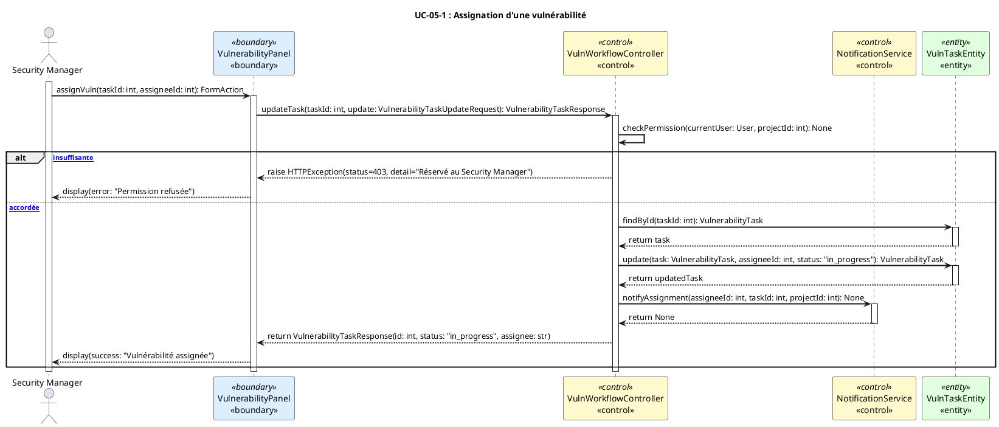

**Explication** : Le `Security Manager` sélectionne une vulnérabilité et désigne un développeur dans `VulnerabilityPanel`. `VulnWorkflowController` vérifie les droits, récupère la tâche via `VulnTaskEntity`, la met à jour (statut `in_progress`, assigné), puis notifie le développeur via `NotificationService`.

---

### Diagramme de séquence : UC-05-2 — Changement de Statut d'une Vulnérabilité

**Acteur(s)** : Developer

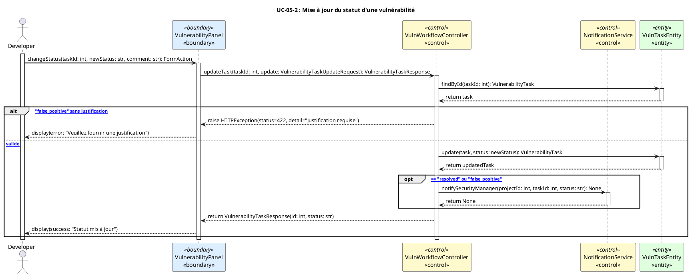

**Explication** : Le `Developer` change le statut d'une tâche via `VulnerabilityPanel`. Si le statut est `false_positive` sans justification, une erreur 422 est retournée. Pour les transitions `resolved` ou `false_positive`, `NotificationService` notifie le Security Manager afin qu'il puisse valider la décision.

---

## Sprint 6 — Dashboard, Rapports & Recommandations LLM

### Objectif du Sprint
Offrir des tableaux de bord adaptés par rôle (Admin, Developer, Security Manager), un système de score de risque, des recommandations LLM pour chaque vulnérabilité, et l'export de rapports.

### User Stories

| ID | User Story | Critères d'acceptation | Points |
|----|-----------|------------------------|--------|
| US-06-1 | En tant que **Developer**, je veux voir mon tableau de bord personnalisé afin d'avoir une vue d'ensemble de mes projets et vulnérabilités. | - Statistiques : projets actifs, scans récents, vulnérabilités ouvertes - Graphiques d'évolution par sévérité | 5 |
| US-06-2 | En tant que **Security Manager**, je veux voir le tableau de bord sécurité global afin de piloter la posture de sécurité. | - Vue cross-projets : scores de risque, top vulnérabilités - Projets par statut de validation | 5 |
| US-06-3 | En tant qu'**Admin**, je veux voir le tableau de bord administrateur afin de superviser l'utilisation de la plateforme. | - Stats utilisateurs actifs, scans lancés, projets créés - Actions rapides (suspendre, archiver) | 3 |
| US-06-4 | En tant que **Developer / Security Manager**, je veux obtenir des recommandations LLM pour une vulnérabilité afin d'accélérer la correction. | - Bouton "Get AI Recommendation" disponible - Recommandation inclut : explication, code fix example, références CWE/OWASP | 5 |
| US-06-5 | En tant que **Security Manager**, je veux exporter un rapport de scan afin de le partager avec les parties prenantes. | - Export JSON disponible - Rapport inclut : résumé, liste vulnérabilités, score de risque - Export PDF si disponible | 3 |

**Total Sprint 6 : 21 points**

### Tâches techniques

**Backend**
- [ ] `GET /dashboard` — statistiques personnalisées par rôle
- [ ] `GET /admin/dashboard` — statistiques admin
- [ ] `GET /security/dashboard` — vue Security Manager
- [ ] `POST /projects/{id}/llm/recommend` — recommandation LLM par vulnérabilité
- [ ] `GET /projects/{id}/scans/{scanId}/report` — export rapport JSON
- [ ] Service `risk_score` — calcul et historique
- [ ] Service `llm` — intégration LLM (OpenAI / local)

**Frontend**
- [ ] Page `Dashboard.jsx` — vue adaptative par rôle
- [ ] Composants graphiques (Charts) : sévérités, évolution
- [ ] Page `Summaries.jsx` — résumés de scans
- [ ] Modal `SummaryModal.jsx` — détail d'un résumé
- [ ] Bouton export rapport

**Tests**
- [ ] Test dashboard Developer vs Security Manager vs Admin (RBAC)
- [ ] Test recommandation LLM (mock LLM)
- [ ] Test export rapport

---

### Diagramme de séquence : UC-06-1 — Tableau de Bord Developer

**Acteur(s)** : Developer

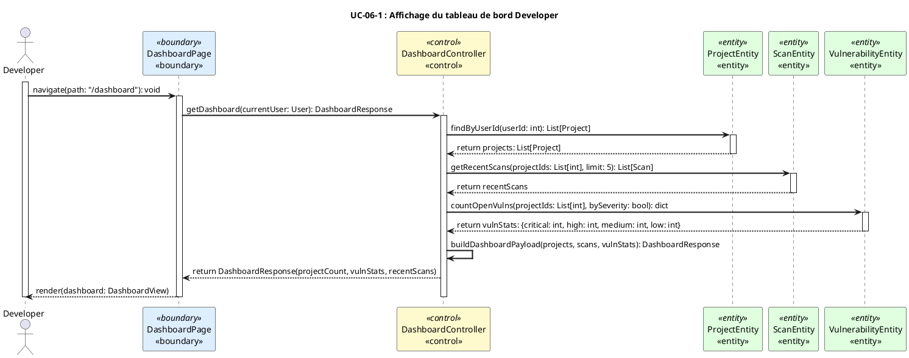

**Explication** : Le `Developer` accède au dashboard via `DashboardPage`. `DashboardController` récupère séquentiellement les projets (`ProjectEntity`), les scans récents (`ScanEntity`) et les statistiques de vulnérabilités (`VulnerabilityEntity`), agrège les données, et retourne un payload complet rendu par l'UI. La séparation des entités reflète la stricte isolation des responsabilités.

---

### Diagramme de séquence : UC-06-4 — Recommandation LLM pour une Vulnérabilité

**Acteur(s)** : Developer

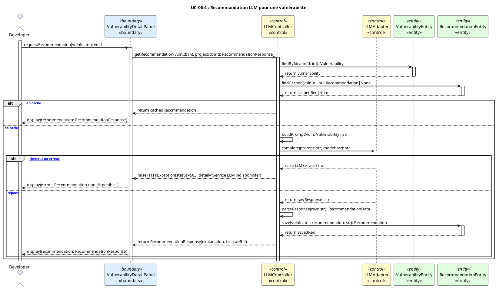

**Explication** : Le `Developer` demande une recommandation via `VulnerabilityDetailPanel`. `LLMController` vérifie d'abord un cache dans `RecommendationEntity`. Sans cache, il construit le prompt à partir de la vulnérabilité, le soumet à `LLMAdapter` (interfaçant OpenAI ou un modèle local). En cas d'erreur LLM, une erreur 503 est retournée. La recommandation est mise en cache pour les requêtes futures.

---

## Sprint 7 — API Keys, Audit Logs & Notifications

### Objectif du Sprint
Implémenter la gestion des clés API pour l'intégration programmatique, le journal d'audit complet des actions sensibles, et le système de notifications temps réel (cloche + Socket.IO).

### User Stories

| ID | User Story | Critères d'acceptation | Points |
|----|-----------|------------------------|--------|
| US-07-1 | En tant que **Developer**, je veux générer des clés API afin d'intégrer InvisiThreat dans mes pipelines CI/CD. | - Génération clé avec nom, expiration optionnelle - Clé visible une seule fois à la création - Liste des clés actives sans valeur complète | 5 |
| US-07-2 | En tant qu'**Admin**, je veux consulter les journaux d'audit afin de surveiller les actions sensibles sur la plateforme. | - Filtres par utilisateur, action, date - Pagination - Export possible | 3 |
| US-07-3 | En tant qu'**Utilisateur**, je veux recevoir des notifications en temps réel afin d'être alerté des événements importants. | - Cloche de notification avec badge - Notifications : scan terminé, vulnérabilité assignée, rôle modifié - Marquer comme lu / tout marquer | 3 |
| US-07-4 | En tant que **Developer**, je veux consulter mes propres journaux d'activité afin de suivre mes actions sur la plateforme. | - Vue "My Activity" accessible dans les settings - Filtrée aux actions propres à l'utilisateur | 2 |

**Total Sprint 7 : 13 points**

### Tâches techniques

**Backend**
- [ ] `POST /api-keys` — génération clé API (hash SHA-256 stocké)
- [ ] `GET /api-keys` — liste des clés (sans secret complet)
- [ ] `DELETE /api-keys/{id}` — révocation
- [ ] Middleware `get_user_from_api_key` — auth par clé API
- [ ] `GET /audit-logs` (Admin) — journal global paginé
- [ ] `GET /me/audit-logs` — journal personnel
- [ ] Service notification : `create_notification`, `mark_as_read`
- [ ] Socket.IO : événement `notification` en temps réel
- [ ] `GET /notifications` + `PATCH /notifications/{id}/read` + `PATCH /notifications/read-all`

**Frontend**
- [ ] Page `AuditLogsPage.jsx` — consultation logs
- [ ] Composant `NotificationBell.jsx` — cloche avec badge
- [ ] Page `NotificationsPage.jsx` — vue complète
- [ ] Onglet API Keys dans `SettingsPage.jsx`

**Base de données**
- [ ] Modèles `ApiKey` (hash), `AuditLog`, `Notification`
- [ ] Migration Alembic

**Tests**
- [ ] Test génération + authentification par clé API
- [ ] Test audit log : action journalisée après chaque opération sensible
- [ ] Test notification temps réel (Socket.IO mock)

---

### Diagramme de séquence : UC-07-1 — Génération d'une Clé API

**Acteur(s)** : Developer

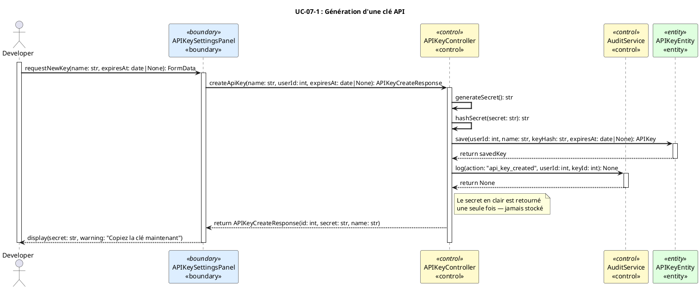

**Explication** : Le `Developer` crée une clé via `APIKeySettingsPanel`. `APIKeyController` génère un secret cryptographiquement aléatoire, en stocke uniquement le hash SHA-256 dans `APIKeyEntity` (jamais le secret en clair), journalise l'action dans `AuditService`, et retourne le secret en clair une unique fois à l'utilisateur.

---

### Diagramme de séquence : UC-07-3 — Notification Temps Réel

**Acteur(s)** : Utilisateur authentifié

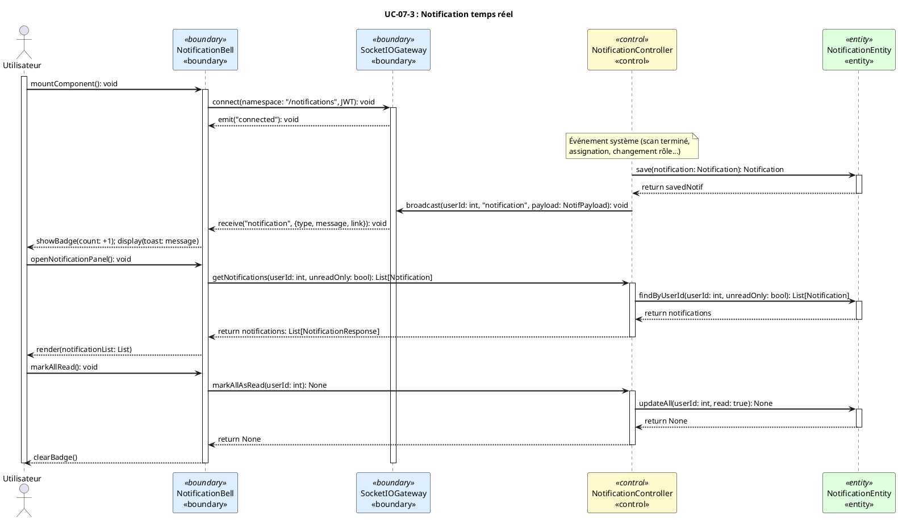

**Explication** : `NotificationBell` (boundary UI) s'abonne aux événements Socket.IO via `SocketIOGateway`. Lorsqu'un événement système se produit, `NotificationController` persiste la notification dans `NotificationEntity` et diffuse un événement au client ciblé. L'utilisateur peut consulter, puis marquer toutes les notifications comme lues.

---

## Sprint 8 — Intégration, Tests & Documentation

### Objectif du Sprint
Finaliser la plateforme avec des tests d'intégration end-to-end, corriger les bugs identifiés, documenter l'API et le projet, et préparer le rapport académique final.

### User Stories

| ID | User Story | Critères d'acceptation | Points |
|----|-----------|------------------------|--------|
| US-08-1 | En tant que **Tech Lead**, je veux des tests d'intégration E2E couvrant les flux critiques afin de valider la stabilité de la plateforme. | - Couverture tests ≥ 80% sur les routes critiques - Tests : auth, scans, workflow vulnérabilités, notifications - CI exécute tous les tests | 8 |
| US-08-2 | En tant que **Tech Lead**, je veux une documentation API complète afin que les intégrateurs puissent utiliser InvisiThreat. | - Swagger/OpenAPI auto-généré via FastAPI - Description de chaque endpoint - Exemples de requêtes/réponses | 3 |
| US-08-3 | En tant que **PM**, je veux que le rapport de projet final soit rédigé afin de présenter InvisiThreat à l'évaluation académique. | - Rapport inclut : contexte, architecture, sprints, UML, résultats - Diagrammes de classes et de séquences inclus | 5 |
| US-08-4 | En tant que **DevOps**, je veux que le déploiement Docker soit optimisé et documenté afin de faciliter la mise en production. | - `docker-compose up --build` sans erreur - Variables d'env documentées - Health checks configurés | 3 |
| US-08-5 | En tant que **QA**, je veux que tous les bugs critiques détectés soient corrigés afin que la plateforme soit stable. | - Backlog de bugs priorisé - Tous les bugs P0/P1 corrigés - Tests de non-régression ajoutés | 5 |

**Total Sprint 8 : 24 points**

### Tâches techniques

**Backend**
- [ ] Compléter suite de tests Pytest (intégration + unitaires)
- [ ] Audit sécurité : OWASP Top 10 review
- [ ] Optimisation queries N+1 SQLAlchemy
- [ ] Révision et complétion des docstrings FastAPI (OpenAPI)

**Frontend**
- [ ] Tests composants critiques (Vitest / React Testing Library)
- [ ] Vérification accessibilité (ARIA labels)
- [ ] Optimisation bundle (lazy loading routes)

**Documentation**
- [ ] `README.md` complet avec guide d'installation
- [ ] Documentation architecture dans `docs/`
- [ ] Rapport académique final avec UML

**DevOps**
- [ ] Optimisation Dockerfile (multi-stage build)
- [ ] Configuration health checks Docker
- [ ] Review pipeline CI/CD final

---

### Diagramme de séquence : UC-08-1 — Cycle de Test E2E — Flux Scan Complet

**Acteur(s)** : TestRunner (CI/CD)

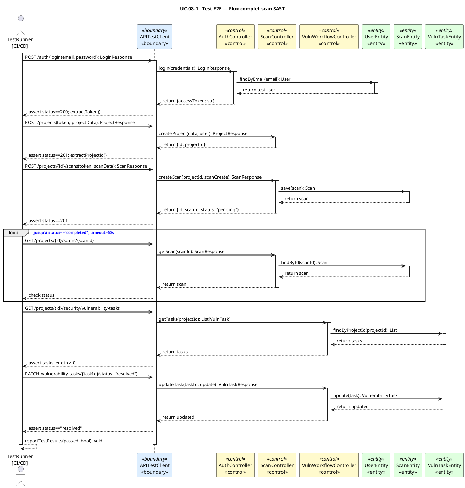

**Explication** : Le `TestRunner` (CI/CD) simule le flux complet via `APITestClient` (boundary de test). Il enchaîne : authentification → création projet → lancement scan → polling du statut → consultation des tâches de vulnérabilités → résolution d'une tâche. Ce scénario valide l'intégration verticale de toute la chaîne. Les assertions à chaque étape garantissent la non-régression.

---

## Récapitulatif de la Planification

| Sprint | Objectif | Durée | Points |
|--------|---------|-------|--------|
| Sprint 0 | Infrastructure & Architecture | 2 semaines | 16 |
| Sprint 1 | Authentification & RBAC | 2 semaines | 24 |
| Sprint 2 | Gestion Projets & GitHub | 2 semaines | 16 |
| Sprint 3 | Scan SAST | 2 semaines | 23 |
| Sprint 4 | Scan DAST | 2 semaines | 16 |
| Sprint 5 | Workflow Vulnérabilités | 2 semaines | 16 |
| Sprint 6 | Dashboard, Rapports & LLM | 2 semaines | 21 |
| Sprint 7 | API Keys, Audit & Notifications | 2 semaines | 13 |
| Sprint 8 | Intégration, Tests & Documentation | 2 semaines | 24 |
| **Total** | | **18 semaines** | **169 points** |

---

## Référentiel Acteurs & Stéréotypes BCE

### Acteurs identifiés

| Acteur | Description |
|--------|-------------|
| Admin | Administrateur système — tous droits |
| Developer | Développeur — scans, projets, vulnérabilités |
| Security Manager | Responsable sécurité — workflow vulnérabilités, rapports |
| Viewer | Lecture seule |
| TestRunner | Agent CI/CD automatisé |

### Convention stéréotypes BCE

| Stéréotype | Notation PlantUML | Rôle dans les diagrammes |
|-----------|-------------------|--------------------------|
| `«boundary»` | `<<boundary>>` | Formulaires UI, clients API, gateway Socket.IO |
| `«control»` | `<<control>>` | Controllers FastAPI, Services, Workers Celery |
| `«entity»` | `<<entity>>` | Modèles SQLAlchemy, entités persistées en DB |

> **Règle invariante** : Tout flux respecte strictement la séquence `Acteur → «boundary» → «control» → «entity»`. Aucune interaction directe Acteur ↔ «entity» n'est autorisée.
